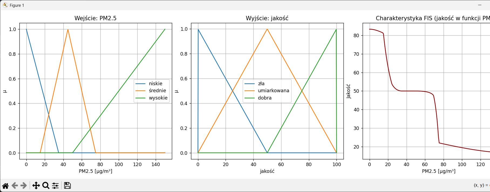
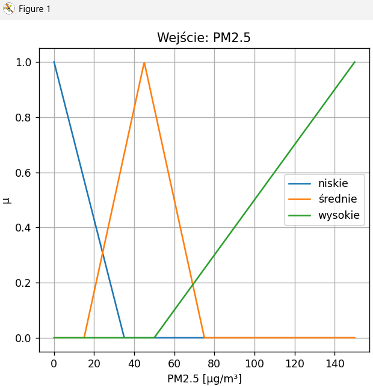
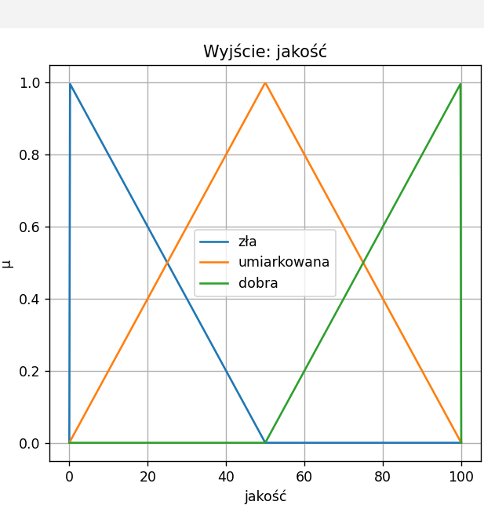
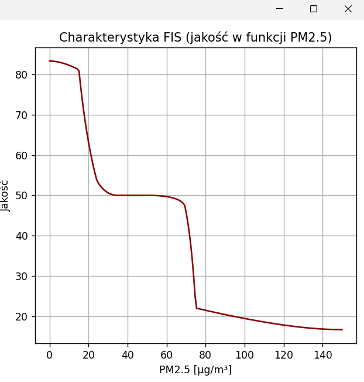
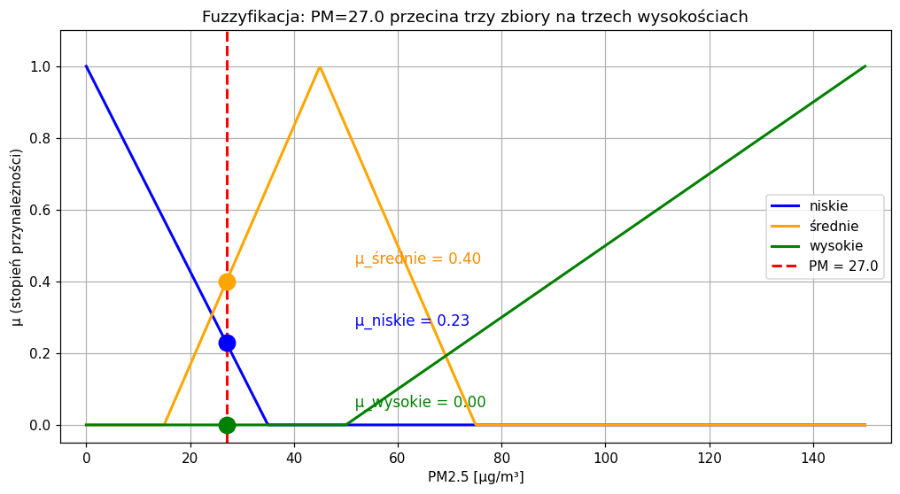
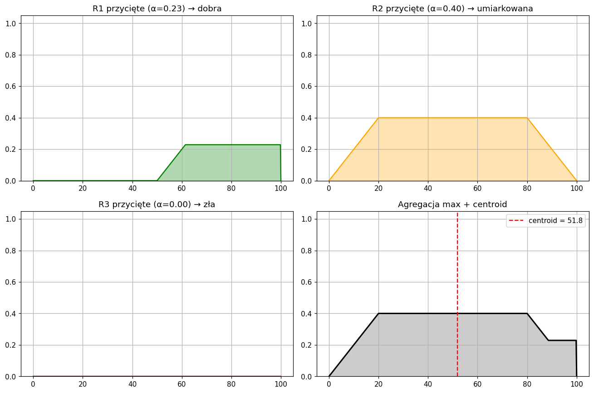

# System Wnioskowania Rozmytego - Ocena Jakości Powietrza 

### Temat projektu

Projekt realizuje **Temat A3** dotyczącego **oceny jakości powietrza** na podstawie pomiaru stężenia pyłu zawieszonego PM2.5. Celem jest zbudowanie systemu wnioskowania rozmytego (FIS), który zamienia pojedynczy odczyt z miernika pyłu na liczbową ocenę jakości powietrza w skali 0-100.

### Charakterystyka danych wejściowych

Źródłem danych jest plik xlsx zawierający **50 pomiarów PM2.5** w jednostce μg/m³. Każdy wiersz ma trzy kolumny:

| Kolumna | Opis |
|---|---|
| `PM2.5 [μg/m³]` | wartość liczbowa stężenia pyłu w zakresie ok. 0.7 - 146.6 |
| `Kategoria lingwistyczna` | słowna etykieta (`niskie`, `umiarkowane`, `wysokie`) - służy do porównania z wynikiem modelu |
| `Wynik FIS (do uzupełnienia)` | kolumna do uzupełnienia wynikiem FIS |

### Oczekiwany wynik

Dla każdej wartości PM2.5 program ma zwrócić **jedną liczbę z zakresu [0, 100]** reprezentującą jakość powietrza, gdzie **wysokie liczby oznaczają lepsze powietrze** (0 = bardzo złe, 100 = idealne). Konkretnie:

- Niskie stężenia (PM < ~15) powinny dawać wynik bliski 80–100 czyli powietrze dobrej jakości
- Średnie stężenia (PM ~30–60) powinny dawać wynik w okolicy 40–60 czyli jakość umiarkowana
- Wysokie stężenia (PM > ~80) powinny dawać wynik 15–25 czyli powietrze złej jakości

Drugim oczekiwaniem jest, by wynik modelu był w większości **zgodny z etykietą lingwistyczną** z bazy.

## Zbiory rozmyte

### Wejście - PM2.5 [μg/m³]

Trzy zbiory pokrywające skalę 0–150 μg/m³, wszystkie zaimplementowane przez `trimf`:

| Zbiór | Wzór | Wierzchołek |
|---|---|---|
| niskie | `trimf(PM, -35, 0, 35)` | PM = 0 |
| średnie | `trimf(PM, 15, 45, 75)` | PM = 45 |
| wysokie | `trimf(PM, 50, 150, 250)` | PM = 150 |

Zbiory **zachodzą na siebie parami**: niskie i średnie zachodzą w okolicy PM=15–35, średnie i wysokie w okolicy PM=50–75. Dzięki temu przejścia są płynne, a wartości graniczne (np. PM=27) aktywują jednocześnie dwie reguły.

### Wyjście - jakość [0, 100]

Trzy zbiory zaimplementowane przez `trimf` na siatce 500 punktów (`np.linspace(0, 100, 500)`):

| Zbiór | Wzór | Wierzchołek |
|---|---|---|
| zła | `trimf(Jakosc, 0, 0, 50)` | jakość = 0 |
| umiarkowana | `trimf(Jakosc, 0, 50, 100)` | jakość = 50 |
| dobra | `trimf(Jakosc, 50, 100, 100)` | jakość = 100 |

Skala jakości jest skonstruowana tak, że **wysokie liczby oznaczają lepszą jakość powietrza**: zła = bliska 0, umiarkowana = środek, dobra = bliska 100.

## Reguły wnioskowania

Trzy reguły IF–THEN:

| Reguła | Przesłanka | Konkluzja |
|---|---|---|
| R1 | IF PM IS niskie | THEN jakość IS **dobra** |
| R2 | IF PM IS średnie | THEN jakość IS **umiarkowana** |
| R3 | IF PM IS wysokie | THEN jakość IS **zła** |

**Mapowanie jest „na krzyż"**: niskie stężenie pyłu (przesłanka niska) odpowiada wysokiej wartości na skali jakości (konkluzja: dobra = wysokie liczby). 

## Analiza wykresów

### Wykres główny - trzy panele

**Panel lewy (Wejście: PM2.5)** - funkcje przynależności wejścia. Widoczne trzy trójkąty z wierzchołkami w PM=0, 45 i 150. Skrajne trójkąty są szersze (sięgają poza skalę), więc w obrazie widać tylko ich „wewnętrzne" zbocza opadające do osi PM=35 i rosnące od PM=50. Obszary nakładania (PM≈15–35 oraz PM≈50–75) ilustrują właśnie tą rozmytość przejść między kategoriami.

**Panel środkowy (Wyjście: jakość)** - trzy zbiory wyjścia na skali 0–100. Symetryczny układ z wierzchołkiem zbioru *umiarkowana* dokładnie w środku (50) i półtrójkątami na brzegach.

**Panel prawy (Charakterystyka FIS)** - wynik systemu jako funkcja PM. Widoczne trzy „plateau" w okolicach 83, 50 i 17 - to przybliżone centroidy zbiorów *dobra*, *umiarkowana* i *zła*. Między plateau łagodne przejścia ilustrują kluczową cechę FIS: płynną interpolację zamiast skoków, jakie dałby klasyczny `if/elif/else`.

### Ilustracja fuzzyfikacji (PM=27)

Pionowa linia w punkcie PM=27 przecina trzy zbiory wejścia w trzech różnych punktach:
- **μ_niskie = 0.23** (przecięcie z opadającym zboczem trójkąta „niskie")
- **μ_średnie = 0.40** (przecięcie z lewym zboczem trójkąta „średnie")
- **μ_wysokie = 0.00** (zbiór „wysokie" zaczyna się dopiero od PM=50)

Te trzy liczby są aktywacjami trzech reguł.

### Ilustracja agregacji (PM=27)

Cztery panele pokazują krok po kroku, co dzieje się w funkcji `Wynik`:

- **R1 przycięte** - zbiór *dobra* ścięty poziomo na wysokości 0.23 (trapez po prawej stronie osi).
- **R2 przycięte** - zbiór *umiarkowana* ścięty na wysokości 0.40 (trapez w środku).
- **R3 przycięte** - zbiór *zła* ścięty na wysokości 0.00 (pusta figura - reguła nieaktywna).
- **Agregacja max + centroid** - sklejenie trzech figur w jedną wspólną (czarna obwiednia) i wyznaczenie środka ciężkości (czerwona linia, 51.8).

Centroid wypada **w prawo od środka skali** (51.8 zamiast 50), ponieważ reguła R1 dorzuca „masę" po prawej stronie figury. Gdyby aktywna była tylko R2, centroid wypadłby dokładnie na 50.

## Analiza wyników

Pierwsze 5 wierszy bazy po obliczeniach:

| Lp. | PM2.5 [μg/m³] | Etykieta z bazy | Wynik FIS |
|---|---|---|---|
| 1 | 27.0 | niskie | 51.78 |
| 2 | 59.8 | umiarkowane | 49.71 |
| 3 | 5.5 | niskie | 82.92 |
| 4 | 33.3 | niskie | 50.06 |
| 5 | 75.9 | wysokie | 21.97 |

### Interpretacja przypadków testowych

**Wiersz 3 (PM=5.5 -> 82.9):** bardzo niskie zanieczyszczenie. Aktywna jest niemal wyłącznie reguła R1 (niskie -> dobra) z wysoką aktywacją. Wynik bliski centroidu zbioru *dobra* (~83). Interpretacja lingwistyczna: powietrze dobrej jakości - zgodne z etykietą bazy.

**Wiersz 5 (PM=75.9 -> 22.0):** silne zanieczyszczenie. Dominuje reguła R3 (wysokie -> zła), R2 wnosi niewielki wkład. Wynik blisko centroidu zbioru *zła* (~17). Interpretacja: powietrze złej jakości - zgodne z etykietą bazy.

**Wiersz 2 (PM=59.8 -> 49.7):** wartość pośrednia. Aktywują się jednocześnie R2 (średnie) z aktywacją 0.51 oraz R3 (wysokie) z aktywacją 0.20. Centroid wypada w okolicy środka skali, lekko pod 50, ponieważ R3 dociąga wynik w stronę niskich wartości. 

**Wiersze 1 i 4 (PM=27 -> 51.8, PM=33.3 -> 50.1):** wartości graniczne. Mimo etykiety „niskie" w bazie, system zwraca wartości w okolicy 50, czyli interpretowane jako „umiarkowane". 

### Prompty oraz model językowy użyty podczas tworzenia projektu

| Model językowy | Wersja | 
|---|---|
| Claude | PRO | 

Przykładowe prompty:

- Robię projekt z TZR na ocenę 3.0, Temat A3 (ocena jakości powietrza z PM2.5). Zaproponuj strukturę systemu FIS zgodną z PDF.
- Zdefiniuj zbiory wyjścia (dobra/umiarkowana/zła) i pokaż jak je podpiąć pod reguły.
- Wyjaśnij mi jak działa defuzzyfikacja centroidem.
- Zamień te 3 osobne ploty na ax1, ax2, ax3 żeby były na jednym wykresie obok siebie.
- Przeanalizuj kod pod kątem 6 wymagań. Sprawdź każdy punkt osobno.

